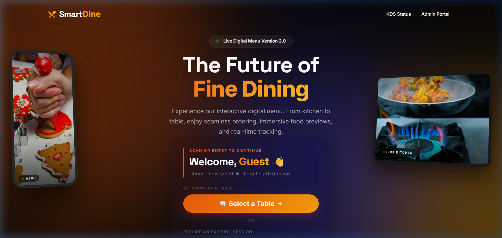
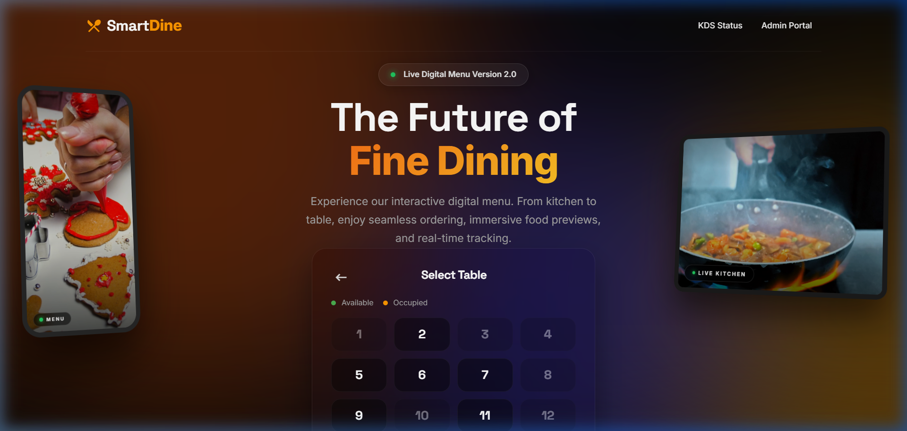
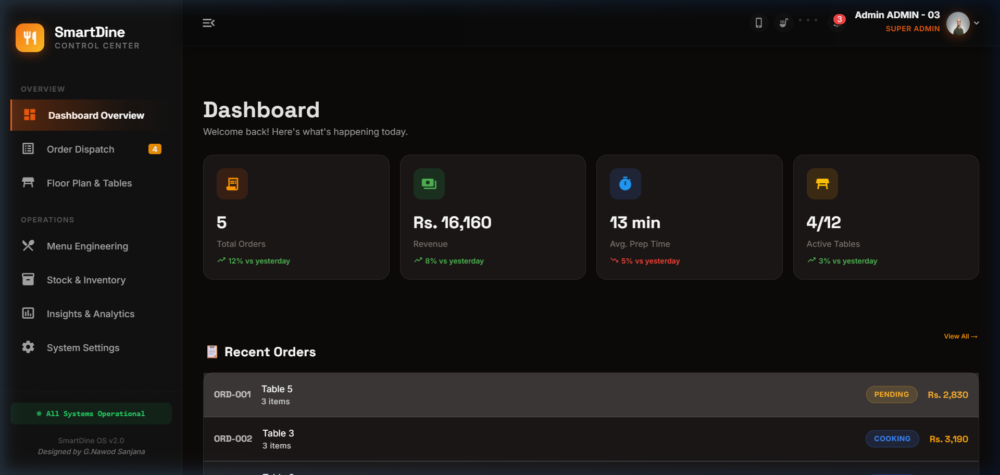
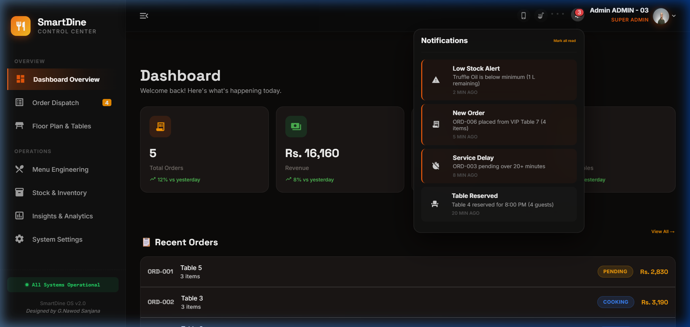
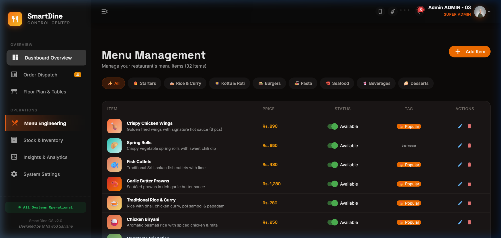

# 🍽️ SmartDine OS - Next-Gen Restaurant Management System

An ultra-modern, fully integrated Kitchen Display System (KDS), Digital QR Menu, and Restaurant Management Portal built with Vue 3, Quasar Framework, and a high-performance backend. Designed for the futuristic dining experience of 2026.

## ✨ Key Features

- **📱 Cinematic Digital Menu:** A highly immersive customer-facing menu platform with dynamic device mockups, auto-playing video showcases (e.g., live kitchen feed and food previews), and a staggered curtain-reveal animation sequence.
- **🍳 Real-time KDS (Kitchen Display System):** Streamlined kitchen operations with live order tracking, status updates (Pending, Cooking, Ready), and instant synchronization.
- **🛡️ Premium Admin Dashboard:** A dark-glassmorphism themed control center to manage menus, track inventory, dispatch orders, and monitor actionable analytics.
- **🔔 Smart Notifications:** Real-time stock alerts and order delays with beautifully crafted, animated UI popups.
- **🔄 Seamless Session Management:** Customers can securely start a new session at a specific table or resume an existing one using a unique Session ID.

## 📸 System Showcase

### Cinematic Landing Page

A dramatic 3-column showcase layout featuring embedded video mockups that slide in from the edges.


### Table Selection & Guest Flow

Intuitive table selection process with real-time occupancy tracking.


### Control Center Dashboard

A robust overview of the restaurant's live statistics, revenue, and recent orders.


### Smart Notifications

Dark glassmorphism notifications alert staff to low inventory or delayed orders seamlessly.


### Menu Engineering

Detailed menu management interface allowing absolute control over categories, items, pricing, and availability.


## 🛠️ Technology Stack

- **Frontend:** Vue 3 (Composition API), Quasar Framework, SCSS for advanced styling and modern animations (glassmorphism, CSS keyframes).
- **Backend:** Node.js, Express.js (or FastAPI depending on environment).
- **State Management:** Pinia for reactive store management.
- **Icons & UI:** Material Symbols, custom SVGs.
- **Media Asset Integration:** Plays inline, muted loop fallback videos for high-end aesthetic presentation.

## 🚀 Getting Started

### Prerequisites

- Node.js (v18+)
- npm or yarn

### Installation

1. **Clone the repository:**

   ```bash
   git clone <repository-url>
   cd Next-Gen-Restaurant-Kitchen-Display-System-KDS-QR-Menu
   ```

2. **Install frontend dependencies:**

   ```bash
   npm install
   ```

3. **Install backend dependencies:**
   ```bash
   cd backend
   npm install
   cd ..
   ```

### Running the Application

1. **Start the backend server:**

   ```bash
   cd backend
   npm run start
   ```

2. **Start the frontend development server:**
   ```bash
   npx quasar dev
   ```
   The application will usually be served at `http://localhost:9001` or `9002`.

## 🎨 Design Philosophy

The entire application follows a "dark premium" design language, bringing high-end hospitality aesthetics to the digital interface. It utilizes space grotesk typography, subtle gradients, drop shadows, and complex z-index layering to ensure every interaction feels alive and responsive.

## 📜 License

This project is proprietary and intended for internal use/demonstration. All rights reserved.
